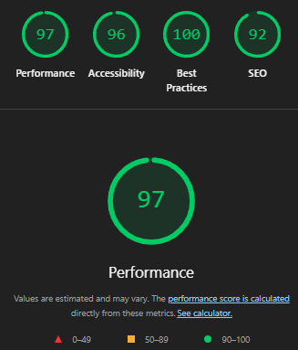

# PDP System - Frontend (Next.js) [](https://codecov.io/gh/deltemp/case-pdp)

Sistema de Página de Detalhes do Produto (PDP) desenvolvido com Next.js, TypeScript e Tailwind CSS.

<hr/>

<center>


<hr/>


<hr/>



</center>

## 🚀 Tecnologias

- **Next.js 15** com App Router
- **React 19** com Server Components
- **TypeScript** em modo strict
- **Tailwind CSS** para estilização
- **Web Vitals** para monitoramento de performance
- **Jest** + **React Testing Library** para testes
- **ESLint** para qualidade de código

## 📁 Estrutura do Projeto

```
src/
├── app/                    # App Router do Next.js
│   ├── product/[sku]/     # Página dinâmica do produto
│   │   ├── page.tsx       # Página principal do produto
│   │   └── not-found.tsx  # Página 404 personalizada
│   ├── layout.tsx         # Layout principal
│   ├── page.tsx           # Página inicial (redireciona)
│   ├── not-found.tsx      # Página 404 global
│   ├── sitemap.ts         # Geração de sitemap
│   └── robots.ts          # Configuração robots.txt
├── components/            # Componentes React
│   ├── AddToCartButton.tsx
│   ├── ProductDetails.tsx
│   ├── ProductImage.tsx
│   ├── SocialActions.tsx  # Ações sociais (compartilhar)
│   ├── StructuredData.tsx # Schema.org para SEO
│   └── PerformanceProvider.tsx # Monitoramento Web Vitals
├── contexts/              # Contextos React
│   └── ProductActionsContext.tsx # Estado global de ações
├── lib/                   # Utilitários e serviços
│   ├── api.ts            # Cliente da API
│   ├── performance.ts    # Monitoramento de performance
│   ├── seo-monitoring.ts # Monitoramento SEO
│   └── sitemap-data.ts   # Dados para sitemap
├── types/                 # Definições TypeScript
│   └── product.ts        # Tipos do produto
└── utils/                 # Funções utilitárias
    └── format.ts         # Formatação de dados
```

## 🛠️ Instalação e Execução

1. **Instalar dependências:**
```bash
npm install
```

2. **Configurar variáveis de ambiente:**
```bash
cp .env.example .env.local
```

3. **Executar em desenvolvimento:**
```bash
npm run dev
```

4. **Executar testes:**
```bash
npm test                    # Executar todos os testes
npm run test:watch         # Executar testes em modo watch
npm run test:coverage      # Executar testes com cobertura
```

5. **Build para produção:**
```bash
npm run build              # Build otimizado para produção
npm run build:analyze      # Build com análise de bundle
npm run build:turbo        # Build com Turbopack
npm start                  # Executar versão de produção
```

6. **Análise e qualidade:**
```bash
npm run lint               # Verificar qualidade do código
npm run lighthouse         # Análise de performance com Lighthouse
```

## 🧪 Testes

O projeto inclui **167 testes** abrangentes para:
- **Componentes React** (ProductImage, ProductDetails, SocialActions)
- **Páginas e rotas** (product/[sku], not-found, layout)
- **Funções utilitárias** (formatação, API client)
- **Contextos** (ProductActionsContext)
- **Monitoramento** (Performance, SEO)
- **Estruturas de dados** (StructuredData, sitemap)

**Status atual:** ✅ **167 testes passando** com excelente cobertura de código

## 🎯 Funcionalidades

### 📄 Páginas e Navegação
- **Página de produto dinâmica** (`/product/[sku]`) com SSR
- **Página inicial** com redirecionamento inteligente
- **Páginas 404 personalizadas** (global e por produto)
- **Navegação otimizada** com Next.js App Router

### 🎨 Componentes e UI
- **ProductImage** com otimização Next.js Image
- **ProductDetails** com informações completas
- **SocialActions** para compartilhamento
- **AddToCartButton** com contexto global
- **Design responsivo** Mobile First

### 🔍 SEO e Performance
- **SSR (Server-Side Rendering)** para SEO otimizado
- **Metadados dinâmicos** por produto
- **Schema.org** (StructuredData) para rich snippets
- **Sitemap automático** (`/sitemap.xml`)
- **Robots.txt** configurado
- **Web Vitals** monitoramento em tempo real
- **Cache de 60 segundos** para dados da API

### ♿ Acessibilidade e UX
- **ARIA labels** e navegação por teclado
- **Tratamento de erros** robusto
- **Loading states** e feedback visual
- **Performance otimizada** (lazy loading, code splitting)

## 🔗 API Integration

O frontend consome a API backend através do endpoint:
- `GET /products/:sku` - Buscar produto por SKU

## 📱 Responsividade

- **Mobile First** design
- **Breakpoints Tailwind:** sm, md, lg, xl
- **Componentes adaptativos** para diferentes telas

## 🚀 Deploy

O projeto está configurado para deploy em:
- **Vercel** (recomendado)
- **Netlify**
- **Docker** (configuração disponível)

## 📄 Licença

Este projeto foi desenvolvido para fins educacionais e de demonstração.
